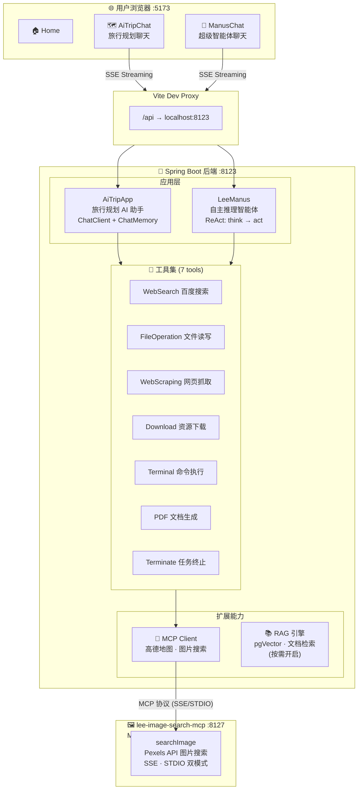

# 🌍 AI 旅行规划大师

基于 **Spring AI + DeepSeek + Vue 3** 的全栈 AI 智能旅行助手。后端以**分层 Agent 架构**和 **ReAct 自主推理**为核心，集成 **MCP 协议**实现工具热扩展，前端提供 SSE 流式聊天的沉浸式交互体验。

---

## 🏗️ 整体架构



---

## 🔧 后端核心亮点

### 1. 四层 Agent 继承体系

所有 Agent 能力收敛到一条清晰的继承链，每一层只增加一个正交职责：

```
BaseAgent                    ← 状态机 + 消息管理 + step 循环（最大步数钳位）
  └─ ReActAgent              ← think() / act() 推理-行动分离
       └─ ToolCallAgent      ← 工具注册、查找、执行，上下文窗口滑动裁剪
            └─ LeeManus      ← 系统 prompt 定义 + 步数/温度等最终参数
```

| 层级 | 类 | 核心职责 |
|------|-----|----------|
| 基础层 | `BaseAgent` | 状态机（`IDLE → RUNNING → FINISHED/ERROR`）、消息上下文、同步/流式双模式 `run()` |
| 推理层 | `ReActAgent` | 将每一步拆成 `think()` 决策 + `act()` 执行，对外暴露流式 hook |
| 工具层 | `ToolCallAgent` | 整合 Spring AI `ToolCallingManager`，屏蔽框架内部工具执行逻辑，自主控制调用链路 |
| 应用层 | `LeeManus` | 注入通用助理 system prompt、最大 8 步、温度 0.3，即开即用 |

### 2. ReAct 自主推理循环

LeeManus 的每一步都在"想"和"做"之间交替，而不是一次性生成答案：

```
┌──────────┐     ┌──────────┐     ┌──────────┐
│  think() │ ──▶ │  act()   │ ──▶ │ observe  │
│ LLM 决策  │     │ 工具执行  │     │ 结果回填  │
└──────────┘     └──────────┘     └──────────┘
       ▲                                │
       └──────── 下一步迭代 ─────────────┘
              (最多 8 步，可配置)
```

- **think()**：LLM 判断当前是否需要用工具、用哪个工具、传什么参数
- **act()**：执行具体工具调用，捕获结果和异常
- **TerminateTool**：LLM 判断任务已完成时主动调用，优雅退出循环，避免无效空转

### 3. 工具系统：全自动注册 + 模块化封装

```
ToolsRegistration (@Configuration)
  ├─ WebSearchTool         → SearchAPI.io → 百度搜索
  ├─ WebScrapingTool       → Jsoup → 网页抓取
  ├─ FileOperationTool     → 本地文件读写 (tmp/file/)
  ├─ ResourceDownloadTool  → URL 资源下载 (tmp/download/)
  ├─ TerminalOperationTool → cmd.exe /c 执行
  ├─ PDFGenerationTool     → iText + 中文字体 (tmp/pdf/)
  └─ TerminateTool         → 任务完成信号
```

每个工具是独立的 `@Component`，通过 `MethodToolCallbackProvider` 扫描 `@Tool` 注解自动注册为 Spring AI ToolCallback，新增工具只需添加一个类，无需修改任何配置。

### 4. 流式输出：三种 SSE 策略

同一份 `Flux<String>` 数据流，提供三种传输方式以适应不同场景：

| 端点 | 实现方式 | 适用场景 |
|------|----------|----------|
| `/ai_trip_app/chat/sse` | `Flux<String>` 直接返回 | 最简接入，前端 `fetch` 读流 |
| `/ai_trip_app/chat/server_sent_event` | `Flux<ServerSentEvent>` 封装 | 需要 event id / retry 等标准 SSE 字段 |
| `/ai_trip_app/chat/sse_emitter` | `SseEmitter` + 手动订阅 | 需要精细控制超时、异常、完成回调 |

### 5. 聊天记忆：Kryo 文件持久化

```
tmp/chat-memory/
  ├── <chat-id-1>.kryo    ← 序列化 Message 列表
  ├── <chat-id-2>.kryo
  └── ...
```

- 实现 `ChatMemory` 接口，每个会话一个 `.kryo` 文件
- **滑动窗口**：仅保留最近 10 条消息，防止 token 爆炸
- **Kryo 序列化**：二进制格式，比 Java 原生序列化快 10x+，文件体积更小
- 配合 `MessageChatMemoryAdvisor` 在每次请求前自动注入历史上下文

### 6. Chat Advisors：可插拔的请求/响应增强

| Advisor | 功能 |
|---------|------|
| `MyLoggerAdvisor` | 对每次请求的 user message 和 assistant response 做 INFO 级别日志，便于调试和审计 |
| `ReReadingAdvisor` | 实现 **Re2 (Re-Reading)** 策略——将用户输入重复注入 prompt，提升 LLM 对关键信息的关注度 |
| `MessageChatMemoryAdvisor` | Spring AI 内置，自动从 ChatMemory 加载历史消息并拼接到当前请求 |

### 7. MCP 协议集成：工具即服务

后端同时扮演 MCP Client，通过 `spring-ai-starter-mcp-client-webflux` 消费外部 MCP Server：

| MCP Server | 传输方式 | 提供能力 |
|------------|----------|----------|
| 高德地图 (`amap-maps-mcp-server`) | STDIO | 地理编码、POI 搜索、路径规划 |
| lee-image-search-mcp | SSE / STDIO | Pexels 图片搜索 |

MCP Server 工具与本地工具在 Agent 视角下**无差异**——统一通过 `ToolCallback[]` 注入，LLM 自主选择调用。

### 8. RAG 检索增强（按需开启）

预留完整的 RAG 管线，默认关闭，需要时改配置即可启用：

```
Markdown 文档 → TripAppDocumentLoader → TokenTextSplitter
                                         → pgVector 向量存储
                                         → QueryRewritten（查询改写）
                                         → VectorStoreFilter（相关性过滤）
                                         → 上下文增强回答
```

---

## 📦 项目组成

| 子项目 | 目录 | 技术栈 | 定位 |
|--------|------|--------|------|
| 🔧 **后端服务** | `./` | Spring Boot 3.5.15 · Spring AI 1.1.2 · Java 21 | 核心：Agent 推理 + 工具调用 + API 服务 |
| 🎨 **前端应用** | `./lee-ai-agent-frontend/` | Vue 3.4 · Vite 5.3 | SPA 聊天界面，SSE 流式渲染 |
| 🖼️ **MCP 图片搜索** | `./lee-image-search-mcp/` | Spring Boot 3.5.15 · Spring AI MCP Server | MCP 工具服务，为 Agent 提供图片检索能力 |

---

## ✨ 功能概览

### 🗺️ AI Trip 旅行规划

以专业旅行规划师为 system prompt 的对话 AI，专注三类场景：
- **短期休闲游** — 周边目的地、行程天数、娱乐安排
- **城市深度游** — 地标打卡、美食探索、交通攻略
- **户外长途游** — 路线规划、装备建议、住宿安排

> 支持会话记忆（Kryo 持久化）、SSE 流式输出、快捷提示词、Markdown 渲染。

### 🧠 LeeManus 超级智能体

基于 ReAct 模式的自主 Agent，LLM 自行决定调用哪些工具、何时结束：

| 工具 | 能力 |
|------|------|
| 🔍 `webSearch` | 百度搜索，返回 Top 5 结构化结果 |
| 🌐 `webScraping` | Jsoup 抓取任意网页完整内容 |
| 📄 `fileOperation` | 读写本地 UTF-8 文件 |
| 📥 `resourceDownload` | 从 URL 下载任意资源 |
| 💻 `terminalOperation` | 执行 Windows 终端命令 |
| 📝 `pdfGeneration` | 生成含中文字体的 PDF 文档 |
| ⏹️ `terminate` | LLM 主动结束任务循环 |

> 最多 8 步推理、SSE 流式输出、每一步的思考-行动过程透明可见。

---

## 🚀 快速开始

### 环境要求

- **JDK** >= 21 · **Node.js** >= 18 · **Maven**（或用项目自带的 Maven Wrapper）
- **API Keys**：
  - [DeepSeek API Key](https://platform.deepseek.com/) — 必需
  - [SearchAPI.io Key](https://www.searchapi.io/) — 启用网络搜索时需要
  - [Pexels API Key](https://www.pexels.com/api/) / [高德 API Key](https://lbs.amap.com/) — 可选

### 1. 配置并启动后端

编辑 `src/main/resources/application-local.yml`：

```yaml
spring:
  ai:
    deepseek:
      api-key: your_deepseek_api_key
      base-url: https://api.deepseek.com
      chat:
        options:
          model: deepseek-v4-flash

searchapi:
  key: your_searchapi_key    # 可选，启用 webSearch 工具时需要
```

```bash
./mvnw spring-boot:run      # macOS / Linux
mvnw.cmd spring-boot:run    # Windows
```

后端启动后，访问 **`http://localhost:8123/api/doc.html`** 查看 Knife4j 接口文档。

### 2. 启动前端

```bash
cd lee-ai-agent-frontend
npm install
npm run dev                  # http://localhost:5173
```

Vite 自动将 `/api` 前缀请求代理到 `localhost:8123`。

### 3. 启动 MCP 图片搜索（可选）

```bash
cd lee-image-search-mcp
# 编辑 src/main/java/.../tools/ImageSearchTool.java 中的 API_KEY
./mvnw spring-boot:run       # http://localhost:8127
```

---

## 📡 API 端点

| 方法 | 路径 | 参数 | 说明 |
|------|------|------|------|
| GET | `/api/ai/ai_trip_app/chat/sync` | `message`, `chatId` | 同步旅行规划 |
| GET | `/api/ai/ai_trip_app/chat/sse` | `message`, `chatId` | SSE 流式旅行规划（`Flux<String>`） |
| GET | `/api/ai/ai_trip_app/chat/server_sent_event` | `message`, `chatId` | SSE 流式（`ServerSentEvent` 封装） |
| GET | `/api/ai/ai_trip_app/chat/sse_emitter` | `message`, `chatId` | SSE 流式（`SseEmitter`，可控超时/回调） |
| GET | `/api/ai/manus/chat` | `message` | SSE 流式 LeeManus 智能体 |

---

## 📁 目录结构

```
lee-ai-trip-agent/                          # 🔧 后端根目录
├── pom.xml                                  # Maven（BOM 统一版本管理）
├── mvnw / mvnw.cmd
├── src/main/java/com/lee/leeaitripagent/
│   ├── LeeAiTripAgentApplication.java       # @SpringBootApplication 入口
│   ├── controller/AiController.java         # REST 接口层
│   ├── app/AiTripApp.java                   # 旅行规划 ChatClient 编排
│   ├── agent/                               # ★ Agent 四层继承体系
│   │   ├── BaseAgent.java                   #   状态机 + 消息管理
│   │   ├── ReActAgent.java                  #   think/act 分离
│   │   ├── ToolCallAgent.java               #   工具执行引擎
│   │   └── LeeManus.java                    #   超级智能体（开箱即用）
│   ├── advisor/
│   │   ├── MyLoggerAdvisor.java             #   请求/响应日志
│   │   └── ReReadingAdvisor.java            #   Re2 重读增强
│   ├── chatmemory/                          #   Kryo 文件聊天记忆
│   ├── tools/                               #   7 个 @Tool 注解的工具
│   │   ├── ToolsRegistration.java           #   工具注册配置
│   │   ├── WebSearchTool.java               #   百度搜索
│   │   ├── WebScrapingTool.java             #   网页抓取
│   │   ├── FileOperationTool.java           #   文件读写
│   │   ├── ResourceDownloadTool.java        #   资源下载
│   │   ├── TerminalOperationTool.java       #   终端命令
│   │   ├── PDFGenerationTool.java           #   PDF 生成（中文）
│   │   └── TerminateTool.java               #   任务终止
│   └── rag/                                 #   RAG 管线（可选）
├── src/main/resources/
│   ├── application.yml                      #   端口 8123，context-path /api
│   ├── application-local.yml                #   DeepSeek / SearchAPI 密钥
│   ├── mcp-servers.json                     #   MCP Client 配置
│   └── documents/                           #   RAG Markdown 知识库
│
├── lee-ai-agent-frontend/                   # 🎨 前端 SPA
│   ├── vite.config.js                       #   Vite + API 代理
│   └── src/
│       ├── views/
│       │   ├── Home.vue                     #   主页
│       │   ├── AiTripChat.vue               #   旅行规划聊天
│       │   └── ManusChat.vue                #   智能体聊天
│       ├── components/
│       │   ├── ChatMessage.vue              #   消息气泡（Markdown 渲染）
│       │   └── ChatInput.vue                #   输入框（IME 兼容）
│       └── utils/sse.js                     #   SSE ReadableStream 封装
│
└── lee-image-search-mcp/                    # 🖼️ MCP 图片搜索服务
    └── src/main/java/.../
        ├── LeeImageSearchMcpApplication.java # MCP Server 入口
        └── tools/ImageSearchTool.java        # searchImage 工具
```

---

## 🛠️ 技术栈速览

| 层级 | 核心技术 |
|------|----------|
| **LLM** | DeepSeek v4 Flash（通过 Spring AI DeepSeek Starter） |
| **AI 框架** | Spring AI 1.1.2 + Spring AI Alibaba Agent Framework 1.1.2 |
| **Agent 模式** | ReAct（Reasoning + Acting），自主工具调用，步数钳位 |
| **工具扩展** | MCP Client WebFlux → 高德地图 / 图片搜索 MCP Server |
| **序列化** | Kryo 5.6.2（聊天记忆持久化） |
| **PDF** | iText 9.6.0 + font-asian（中文 PDF 生成） |
| **Web** | Jsoup 1.22.2（网页抓取）· Hutool 5.8.40（通用工具） |
| **API 文档** | Knife4j 4.4.0（OpenAPI 3，`/api/doc.html`） |
| **前端** | Vue 3.4 · Vite 5.3 · Axios 1.7 · SSE ReadableStream |
| **MCP Server** | Spring AI MCP Server WebMVC（SSE + STDIO 双模式） |

---

## 📄 License

MIT
